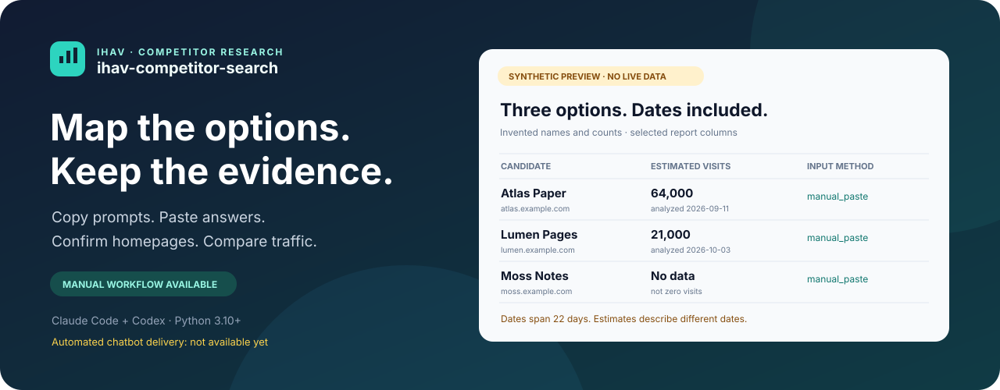
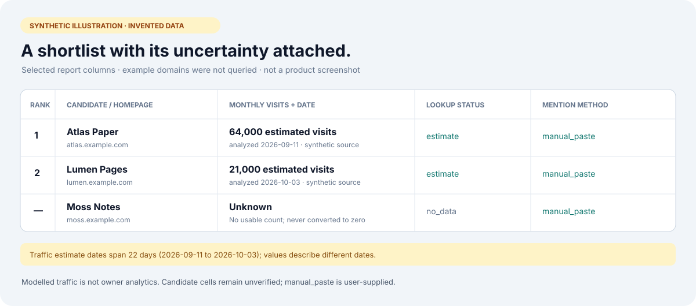

<p align="center"></p>

# ihav-competitor-search

**Turn pasted chatbot answers into a competitor table with traffic dates and traceable cells.**

The manual workflow works today: print a prompt, copy it into chatbots yourself,
paste their JSON answers, check and confirm official homepages, look up traffic
through **ihav-web-visit-counter**, then render JSON, CSV, Markdown and HTML.

**Automated chatbot asking is not ready.** It needs an ihav-web-chat release with
`delivery read/wait` and `doctor --json`, plus a working live send. Those commands
exist in ihav-web-chat's development branch but are not released, and no provider
has a verified live send yet. Until then the capability gate stops with an install
message instead of sending anything. Full cell verification,
automatic survey orchestration and interactive charts are also not built.
The working manual path does not call chatbots or require ihav-web-chat.

[Install](#install) · [Demo](#demo) · [Usage](#usage) · [Accuracy](#accuracy-honestly) · [Privacy](#privacy-and-local-files)

## Install

Requires **Python 3.10+**. The core uses the standard library only.
Start from a local checkout and run the bundled script; no Python package install
is required. From the repository root:

```bash
python3 plugins/ihav-competitor-search/core/ihav-competitor-search/scripts/competitors.py --help
```

For Claude Code and Codex plugin discovery, this repository contains separate
[Claude marketplace](.claude-plugin/marketplace.json) and
[Codex marketplace](.agents/plugins/marketplace.json) manifests and host skills.
Host installation/discovery has not been qualified. The source-script workflow
below is the current executable entry point; this is not a published release.

Traffic lookup additionally needs an installed **ihav-web-visit-counter** script.
Pass its `scripts/visits.py` path with `--counter`, or set `IHAV_VISIT_COUNTER`.
A missing dependency stops with instructions; this plugin does not install it.
See the counter's [repository and README](https://github.com/hiendang7613/ihav-web-visit-counter).
Manual prompts, imports and rendering need neither the counter nor a chatbot child.

## What you get

- **Comparable rows:** conservative product identity, extra columns with meaning,
  type and unit, and provider/round mentions labelled `manual_paste`.
- **Traffic with context:** numeric estimates, display-only estimates, rank-only
  results and missing-data states remain distinct. Dates appear beside values.
- **Traceable exports:** `table.json`, `table.csv`, `evidence.csv`, `table.md` and
  `report.html`, plus per-round synthesis snapshots.
- **Explicit homepage decisions:** a successful GET alone does not confirm a
  product. Confirmation records a URL, date and method before lookup.
- **Recoverable evidence:** raw answers, check outcomes and counter results stay
  in the calling project's local run folder.

These behaviors are exercised in [manual workflow tests](tests/test_manual.py),
[homepage tests](tests/test_homepages.py), [traffic tests](tests/test_visits.py)
and [report tests](tests/test_report_dates_and_raw.py).

## Demo

**Synthetic illustration, not a screenshot or provider result.** Product names,
visit counts and dates below are invented. The `example.com` subdomains are
placeholders and were not queried. The diagram illustrates selected columns;
the actual exports include more status and evidence fields.



For an executable offline example, copy the existing **synthetic test fixture**
into the local runtime area, then render it. Use a fresh run name so you preserve
any work already saved there:

```bash
mkdir -p .ihav_space/ihav-competitor-search/runs
cp -R tests/fixtures/demo .ihav_space/ihav-competitor-search/runs/synthetic-demo
python3 plugins/ihav-competitor-search/core/ihav-competitor-search/scripts/competitors.py render synthetic-demo
```

This fixture contains recorded synthetic inputs. Rendering it makes no live
request. It is a different dataset from the illustration above.

## Usage

Commands use `--project <calling-project>` **before** the subcommand when the
calling project differs from your current directory. Examples below run from
the repository root. Add `.ihav_space/` to the calling project's `.gitignore`.

### 1. Create a saved run and copy the prompt

Use a fresh run name. Create
`.ihav_space/ihav-competitor-search/runs/my-survey/request.json` containing:

```json
{"domain":"document collaboration tools", "options":{"rounds":2,"max_new_columns":5}}
```

The CLI operates on saved runs; it does not create that request for you.
Then print the exact prompt:

```bash
python3 plugins/ihav-competitor-search/core/ihav-competitor-search/scripts/competitors.py prompt my-survey
```

Copy it into each chatbot yourself. The plugin sends nothing in manual mode and
creates no outbound-consent record. See [prompt tests](tests/test_manual.py).

### 2. Import the answers and render

Save each answer as UTF-8 plain or fenced JSON with `columns` and `candidates`
arrays. Each candidate needs `name`, `homepage` and optional `values`:

```json
{"columns":[], "candidates":[{"name":"Atlas Paper", "homepage":"https://atlas.example.com", "values":{"category":"Collaboration"}}]}
```

That JSON is **synthetic**. For your survey, import the actual copied answers:

```bash
python3 plugins/ihav-competitor-search/core/ihav-competitor-search/scripts/competitors.py answer my-survey --round 1 --provider chatgpt --file answer-chatgpt.txt
python3 plugins/ihav-competitor-search/core/ihav-competitor-search/scripts/competitors.py answer my-survey --round 1 --provider gemini --file answer-gemini.txt
python3 plugins/ihav-competitor-search/core/ihav-competitor-search/scripts/competitors.py render my-survey
```

Omitted `--file`, or `--file -`, reads stdin. Invalid JSON is saved with raw text
and `parse_failed`, returning exit `2`. Duplicate round/provider imports are
refused unless you explicitly use `--replace`, which overwrites that saved answer.
Re-render after imports or replacements. See [import tests](tests/test_manual.py).

### 3. Extend the survey

```bash
python3 plugins/ihav-competitor-search/core/ihav-competitor-search/scripts/competitors.py prompt my-survey --round 2
python3 plugins/ihav-competitor-search/core/ihav-competitor-search/scripts/competitors.py answer my-survey --round 2 --provider chatgpt --file answer-round-two.txt
python3 plugins/ihav-competitor-search/core/ihav-competitor-search/scripts/competitors.py render my-survey
```

Later prompts include current candidates and accepted values from prior answers,
ask only for new candidates, and request up to the configured new-column budget.
The default is two rounds. Imports do not automatically send or advance a round.
See [manual tests](tests/test_manual.py) and [merge tests](tests/test_core.py).

### 4. Check, confirm and look up traffic

The following `check` and `lookup` commands **can access the network**. Run them
only for an authorized survey, not on the synthetic demo domains.

```bash
python3 plugins/ihav-competitor-search/core/ihav-competitor-search/scripts/competitors.py check my-survey
python3 plugins/ihav-competitor-search/core/ihav-competitor-search/scripts/competitors.py status my-survey
python3 plugins/ihav-competitor-search/core/ihav-competitor-search/scripts/competitors.py confirm my-survey <candidate_id> --url <checked-final-url>
python3 plugins/ihav-competitor-search/core/ihav-competitor-search/scripts/competitors.py lookup my-survey --counter <installed-counter>/scripts/visits.py --max-lookups 100
python3 plugins/ihav-competitor-search/core/ihav-competitor-search/scripts/competitors.py render my-survey
```

Inspect `homepage_checks.json` and the official page before confirming the
candidate ID shown by status. Do not copy a model-generated URL into a
confirmation without checking the product relationship. Unconfirmed products
remain unqueried. For incorrect pages and one official-site search, follow the
[detailed homepage workflow](plugins/ihav-competitor-search/README.md#homepage-check-and-host-agent-confirmation).
The complete sequence is tested with fake pages and a fake counter in
[test_manual.py](tests/test_manual.py); that is offline evidence, not live qualification.

## What the result means

Numeric estimates sort by descending visits, with own-host rows before shared-host
rows inside their group. Shared products carry `shared_domain: true`; a host's
traffic is not a product's individual traffic. Provider mention counts never
decide rank. Display-only estimates preserve rounded text and have no numeric
traffic rank. Tranco ranks are a separate group and never become visits.

No-data, failed and unqueried rows remain visible with no traffic rank. Missing
cells stay null; typed mismatches retain the raw input and a reason. Repeated
candidates add observations without overwriting existing values. See
[ranking code](plugins/ihav-competitor-search/core/ihav-competitor-search/ihav_competitor_search/rank.py)
and [core tests](tests/test_core.py).

## How it works

`prompt` → person copies to chatbots → `answer` → `render` merges → `check` →
person verifies homepage → `confirm` → `lookup` → `render` with traffic.

The two network boundaries are homepage checks and the counter dependency.
The current core performs no full cell-verification pass. See the short
[implementation guide](docs/public/how-it-works.md) or the
[command reference](plugins/ihav-competitor-search/README.md).

## Accuracy, honestly

- **Visits are modelled estimates**, not website-owner analytics. The counter
  does not provide an independently measured error interval.
- **Small sites often have no number.** Unranked placeholder estimates are
  rejected by the counter; when no source returns usable data, exit `2` becomes
  a no-data row, not zero visits.
- **Dates differ by row.** Reports show analysis dates beside numeric values,
  scrape dates and stale markers for display-only values, and one note when
  available estimate dates span more than `14` calendar days. These timestamps
  do not establish a comparable reporting month.
- **Candidate lists and other cells remain unverified.** Homepage confirmation
  verifies only that relationship. The final `verify` stage is not built.
- **`manual_paste` is user-supplied data.** A typed provider name is attribution,
  not proof of authorship, factual accuracy, completeness or market coverage.

See [report boundary tests](tests/test_report_dates_and_raw.py),
[homepage tests](tests/test_homepages.py), and the counter's accuracy notes in
its [README](https://github.com/hiendang7613/ihav-web-visit-counter#accuracy-honestly).

## Data sources and terms

Traffic comes only through **ihav-web-visit-counter**. Its documented source chain
is WebTrafficChecker → TrafficLens → a downloaded Tranco list; one source supplies
each result. This repository does not scrape those providers directly.

The counter's README states that WebTrafficChecker permits reasonable low-volume
automated use but prohibits building a substantially similar or competing
service from its API. **That clause may apply to this plugin.** The counter
maintainers proceed without operator permission; caching, attribution, caps and
stopping on refusal do not settle whether this use is permitted. TrafficLens
also restricts extraction and reuse, and Tranco has upstream licensing conditions.
Consult the counter's [data sources and terms](https://github.com/hiendang7613/ihav-web-visit-counter#data-sources-and-terms)
before using or redistributing results. This is a summary of the dependency's
documentation, not a fresh legal review or a permission grant.

Homepage `check` sends one initial ordinary GET per eligible unchecked candidate,
with up to three same-host redirects. It uses no cookies or login, does not retry,
and refuses cross-site redirects and HTTPS downgrades. Access refusal or a detected
challenge stops that host. Counter blocks stop further lookups in the run.
See [homepage tests](tests/test_homepages.py) and [counter adapter tests](tests/test_visits.py).

## Privacy and local files

Run files live under `.ihav_space/ihav-competitor-search/runs/<run-id>/` in the
calling project. They include domain text, raw pasted answers, mentions, local
confirmations, homepage diagnostics, raw response evidence, counter results and
exports. Homepage evidence retains up to `64 KiB` of wire bytes and filtered
headers; cookie and authorization-like headers are removed. A response body or
URL can still contain sensitive content. Avoid secrets in inputs and inspect
files before sharing them. Exports intentionally retain provenance.

Manual `prompt` and `answer` make no chatbot calls. You choose what to copy into
chatbots and their own privacy terms apply. `check` sends each candidate's URL to
its website. `lookup` sends confirmed hosts through the counter's documented
providers. The counter cache remains in `.ihav_space/ihav-web-visit-counter/`.
Keep `.ihav_space/` out of Git, use one writer per run, and reconcile interrupted
locks or unknown outcomes before attempting recovery. See the
[runtime reference](plugins/ihav-competitor-search/README.md).

## FAQ

**Can it ask all chatbots automatically?** Not yet. `ask`, `resume` and `collect`
exist, but the child lacks required delivery and versioned capability commands.
Use manual mode; an opt-in does not bypass the capability gate.

**Can it verify every fact?** No. Only explicit homepage confirmation is built;
the final verification stage is not implemented. Other cells stay unverified.

**Why is a candidate missing a visit count?** It may be unconfirmed, have no
provider data, be rank-only, or remain unqueried after a block or lookup cap.
Read `lookup_status`, `lookup_reason` and `rank_basis`, rather than assuming zero.

**Does render access the network?** No. It rebuilds exports from saved inputs.
`prompt`, `answer`, `status` and `confirm` are local too; `check` and `lookup` are
the explicit network stages. See [CLI implementation](plugins/ihav-competitor-search/core/ihav-competitor-search/ihav_competitor_search/cli.py).

## Contributing

Read [CONTRIBUTING.md](CONTRIBUTING.md). Tests use synthetic/saved fixtures and
must not contact live websites. See [CHANGELOG.md](CHANGELOG.md) for the unreleased
`0.1.0` work and [SECURITY.md](SECURITY.md) for safe vulnerability reporting.

## License

MIT, copyright 2026 hiendang7613. See [LICENSE](LICENSE).
The software license does not grant rights to third-party traffic data.
